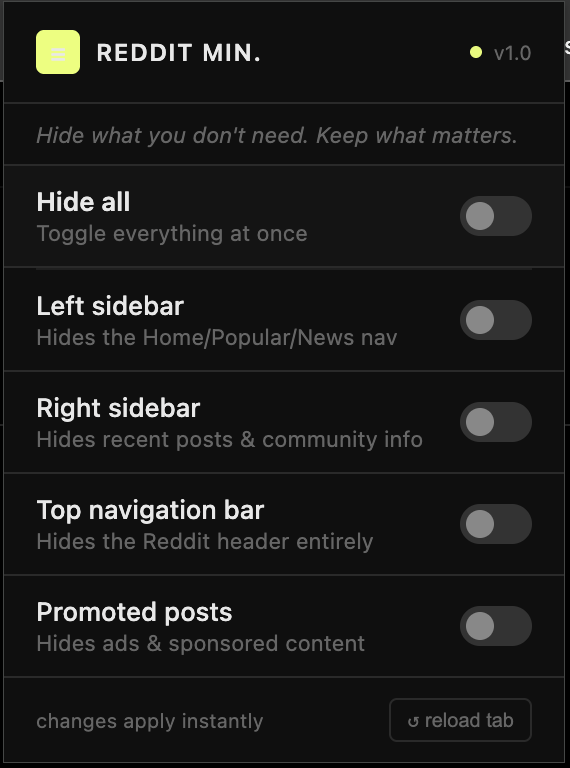

# Reddit Minimizer

A lightweight Chrome extension that declutters Reddit's desktop layout. Hide what you don't need. Keep what matters.



## Features

Toggle each element on or off from the extension popup:

- **Hide all** — turn everything on or off at once
- **Left sidebar** — removes the Home / Popular / News navigation panel
- **Right sidebar** — removes recent posts & community info
- **Top navigation bar** — hides the Reddit header entirely for a distraction-free feed
- **Promoted posts** — filters out ads and sponsored content

All changes apply instantly without needing to reload the page.

## Installation

This extension is not on the Chrome Web Store. Install it manually in a few steps:

1. Download this repository as a ZIP → click **Code → Download ZIP**
2. Unzip the folder somewhere easy to find (e.g. your Desktop)
3. Open Chrome and go to `chrome://extensions`
4. Enable **Developer mode** (toggle in the top-right corner)
5. Click **Load unpacked** and select the unzipped `reddit-minimizer` folder
6. The extension icon will appear in your toolbar — click it to open the panel

## Files

```
reddit-minimizer/
├── manifest.json   # Extension config & permissions
├── content.js      # Injects CSS into Reddit pages
├── popup.html      # Extension popup UI
└── popup.js        # Popup logic & toggle handling
```

## How it works

When you toggle an option, the setting is saved to Chrome's sync storage. The content script reads these settings and injects the corresponding CSS selectors to hide the relevant elements on any Reddit page you visit.

---

Made for personal use. Feel free to fork and customize.
